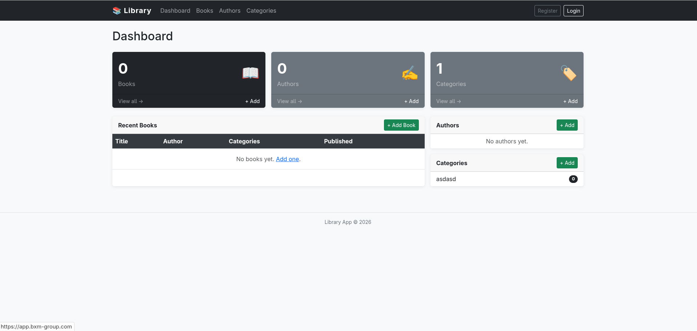
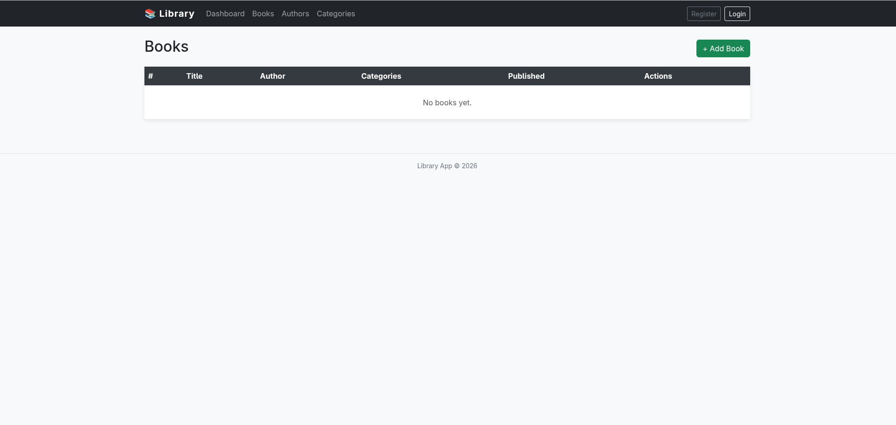
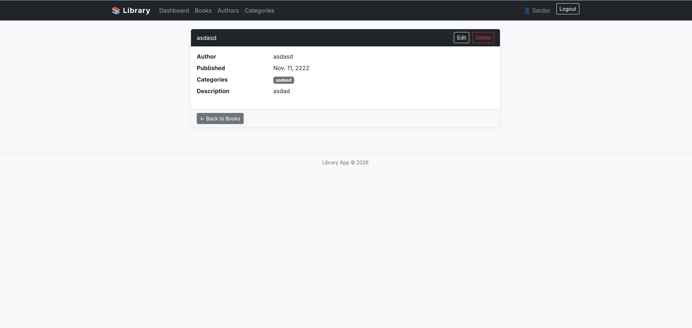
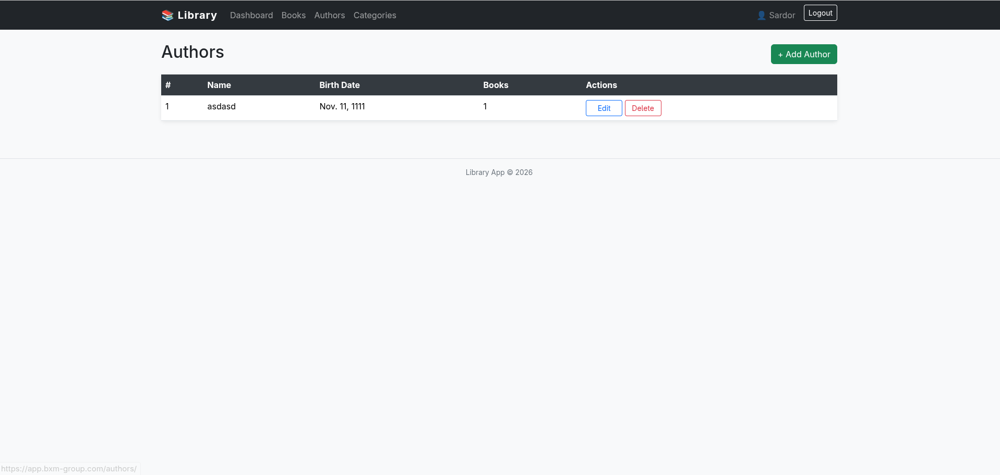
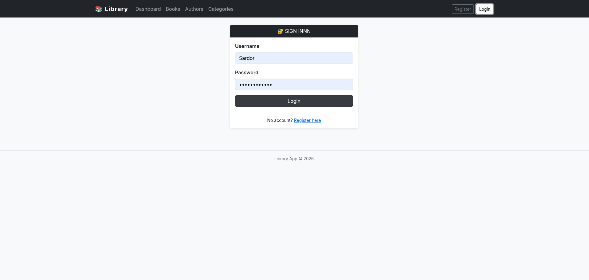

# Alexandria Library

A full-featured web application for managing a digital library — books, authors, and categories — built with Django and deployed via Docker with a fully automated CI/CD pipeline.

---
## Video Demonstration LINK:
- https://drive.google.com/file/d/1Iz1B-8jH1GMpp3Xup5op4b_t-ftOkRmS/view?usp=drive_link

## Features

- **Book Management** — Create, read, update, and delete books with full detail pages
- **Author Management** — Manage author profiles with biography and birth date
- **Category Management** — Organise books into categories with many-to-many relationships
- **User Authentication** — Register, login, and logout with session management
- **REST API** — Full CRUD API for all entities using Django REST Framework with token authentication
- **Admin Panel** — Django admin interface for superuser management
- **Health Check Endpoint** — `/health/` returns JSON status for monitoring
- **Zero-Downtime Deployment** — Rolling container updates via Docker Compose scaling
- **Automated CI/CD** — GitHub Actions pipeline: lint → test → build → deploy on every push

---

## Technologies Used

| Layer | Technology |
|---|---|
| Backend | Python 3.11, Django 5.2, Django REST Framework |
| Database | PostgreSQL 15 |
| Cache / Queue | Redis 7 |
| Web Server | Nginx |
| App Server | Gunicorn |
| Containerisation | Docker, Docker Compose |
| CI/CD | GitHub Actions |
| Image Registry | Docker Hub |
| Code Quality | flake8 |
| Testing | pytest, pytest-django |
| Static Files | WhiteNoise |

---

## Project Structure

```
alexandria-library/
├── library/                    # Main Django app
│   ├── models.py               # Author, Category, Book models
│   ├── views.py                # HTML class-based views
│   ├── api_views.py            # REST API viewsets
│   ├── serializers.py          # DRF serializers
│   ├── forms.py                # Django forms
│   ├── urls.py                 # App URL routing
│   ├── tests.py                # Test suite (20+ tests)
│   └── templates/library/      # HTML templates
├── library_app/
│   ├── settings/
│   │   ├── development.py      # Dev settings
│   │   └── production.py      # Production settings
│   ├── urls.py                 # Root URL config
│   └── wsgi.py
├── nginx/
│   ├── Dockerfile
│   └── nginx.conf              # Nginx reverse proxy config
├── .github/workflows/
│   └── deploy.yml              # GitHub Actions CI/CD pipeline
├── Dockerfile                  # Multi-stage Docker build
├── docker-compose.dev.yml      # Local development stack
├── docker-compose.prod.yml     # Production stack
├── gunicorn.conf.py            # Gunicorn configuration
├── requirements.txt
└── pytest.ini
```

---

## Local Setup

### Prerequisites
- Docker and Docker Compose installed
- Git

### Steps

**1. Clone the repository**
```bash
git clone https://github.com/nevermore360/alexandria-library.git
cd alexandria-library
```

**2. Create environment file**
```bash
cp .env.example .env
```

Edit `.env` with your local values (see [Environment Variables](#environment-variables) below).

**3. Start the development stack**
```bash
docker compose -f docker-compose.dev.yml up -d
```

**4. Run migrations**
```bash
docker compose -f docker-compose.dev.yml exec web python manage.py migrate
```

**5. Create a superuser**
```bash
docker compose -f docker-compose.dev.yml exec web python manage.py createsuperuser
```

**6. Access the application**

| Service | URL |
|---|---|
| Web App | http://localhost:8000 |
| Admin Panel | http://localhost:8000/admin/ |
| REST API | http://localhost:8000/api/ |
| Health Check | http://localhost:8000/health/ |

---

## Running Tests

```bash
# Install test dependencies
pip install -r requirements.txt

# Run full test suite
pytest library/tests.py -v

# Run code quality check
flake8 . --max-line-length=120 --exclude=migrations,__pycache__
```

The test suite covers:
- Model creation and field validation
- Model string representations
- Foreign key and many-to-many relationships
- View responses and status codes
- Authentication and access control
- Dashboard context data

---

## Deployment

### Architecture

```
GitHub Push
    │
    ▼
GitHub Actions
    ├── test       → flake8 + pytest (PostgreSQL sidecar)
    ├── build      → Docker build + push to Docker Hub (:latest + :SHA)
    └── deploy     → SSH into server → pull → rolling update → migrate
```

### CI/CD Pipeline

The pipeline runs automatically on every push to `master`:

1. **Test** — Runs flake8 linting and pytest against a live PostgreSQL container
2. **Build** — Builds the Django and Nginx Docker images, tags with `latest` and commit SHA, pushes to Docker Hub
3. **Deploy** — SSHs into the production server, performs a zero-downtime rolling update, runs migrations and collectstatic

### Manual Deployment

On the server:
```bash
cd /root/sites/alexandria-library
git pull origin master
IMAGE_TAG=latest DOCKERHUB_USERNAME=neverm0re1 \
  docker compose -f docker-compose.prod.yml pull
IMAGE_TAG=latest DOCKERHUB_USERNAME=neverm0re1 \
  docker compose -f docker-compose.prod.yml up -d
docker compose -f docker-compose.prod.yml exec web python manage.py migrate --noinput
docker compose -f docker-compose.prod.yml exec web python manage.py collectstatic --noinput
```

---

## Environment Variables

Create a `.env` file in the project root with the following variables:

```env
# Django
SECRET_KEY=your-secret-key-here
DEBUG=False
ALLOWED_HOSTS=yourdomain.com,your-server-ip

# Database
DB_ENGINE=django.db.backends.postgresql
DB_NAME=library_db
DB_USER=library_user
DB_PASSWORD=your-db-password
DB_HOST=db
DB_PORT=5432

# Docker Hub (used by docker-compose.prod.yml)
DOCKERHUB_USERNAME=neverm0re1
IMAGE_TAG=latest
```

### GitHub Actions Secrets

Configure these in **GitHub → Settings → Secrets and variables → Actions**:

| Secret | Description |
|---|---|
| `DOCKERHUB_USERNAME` | Docker Hub username |
| `DOCKERHUB_TOKEN` | Docker Hub access token |
| `SSH_SECRET_KEY` | Private SSH key for server access |
| `SSH_HOST` | Production server IP or hostname |
| `SSH_USERNAME` | SSH user on the server (e.g. `root`) |

---

## API Reference

All endpoints return JSON. Authentication uses token-based auth.

**Get an API token:**
```bash
curl -X POST http://your-domain/api/token/ \
  -d '{"username": "user", "password": "pass"}' \
  -H "Content-Type: application/json"
```

**Use the token:**
```bash
curl http://your-domain/api/books/ \
  -H "Authorization: Token your-token-here"
```

| Endpoint | Methods | Description |
|---|---|---|
| `/api/authors/` | GET, POST | List / create authors |
| `/api/authors/{id}/` | GET, PUT, PATCH, DELETE | Author detail |
| `/api/categories/` | GET, POST | List / create categories |
| `/api/categories/{id}/` | GET, PUT, PATCH, DELETE | Category detail |
| `/api/books/` | GET, POST | List / create books |
| `/api/books/{id}/` | GET, PUT, PATCH, DELETE | Book detail |
| `/api/token/` | POST | Obtain auth token |
| `/health/` | GET | Health check |

---

## Screenshots

### Dashboard


### Book List


### Book Detail


### Author List


### Login Page


---

## License

This project was developed as part of the DSCC coursework at WIUT.
